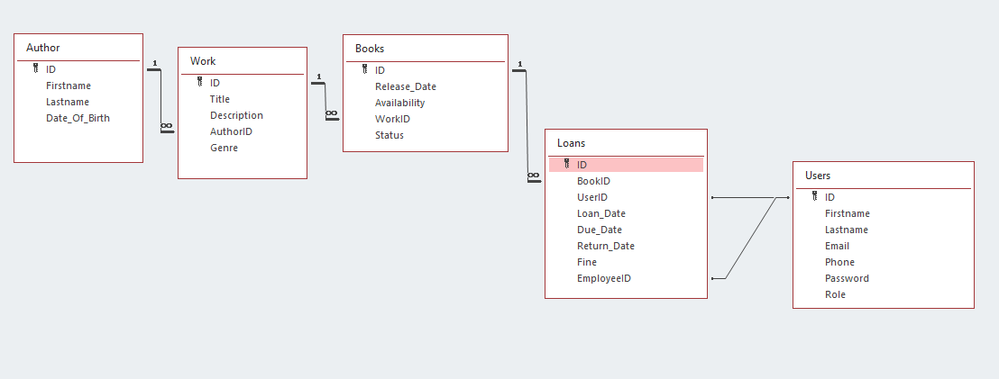

# Library-Management-System

Library management system that allows users to loan and return books, librarians to track book loans, add new books and authors and an admin interface to manange the app.

## Features

1. ** User Authentication **
   - Register and login for both Admins, Users and Librarians

2. ** Author Management **
   - Librarians can add new authors
   - Update author information
   - Search, sort and filter authors

3. ** Book Management **
   - Librarians can add new books
   - Update book information
   - Search, sort and filter books

4. ** Loan Management **
   - Customers can loan and return books
   - Overdue books can be paid for and returned
   - Track loan history and overdue books

5. ** Return Management **
   - Record returned books and update availablity
   - Calculate fines for overdue books

6. ** User Management **
    - Admins can edit user information
    - Admins can delete users
	- Search, sort and filter users

## Database

## Technologies

	
	
	

